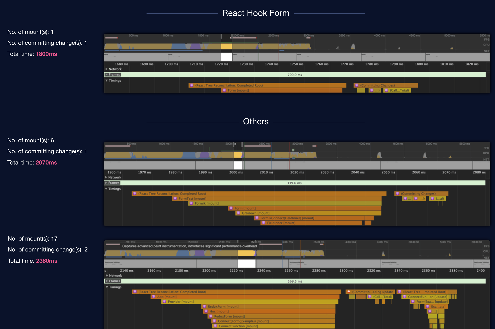

# React Hook Forms VS Formik
https://formik.org/docs/tutorial
https://react-hook-form.com/get-started
## Downloads

## Re-renders

Formik re-renders on every form change.

RHF does not re-renders on every form change except you subscribe to watch event.

## Support of validation libraries

Formik supports yup only.
There are opensource libs like: https://github.com/robertLichtnow/zod-formik-adapter

React hook forms supports Zod, Yup, Joi, Superstruct.
RFF developed a util lib -> npm install @hookform/resolvers yup

## Examples in JS - TS

Formik does not have examples in TS.

RHF support both version of examples.

## Bundle size

Formik - 17.5 kB (gzip) - https://deno.bundlejs.com/badge?q=formik@2.4.4

RHF - 13.1 kB (gzip) - https://deno.bundlejs.com/badge?q=react-hook-form@7.46.1

## Mobile support

Both supports RN.
